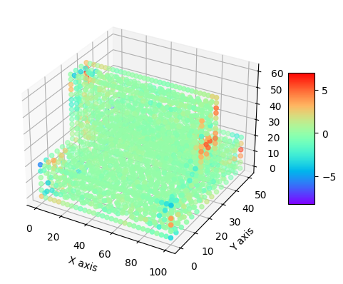
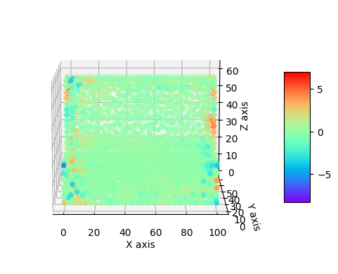
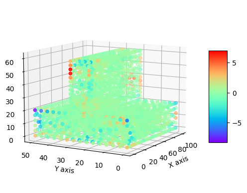

# Comparative Analysis of 3D Heat Transfer Modeling Using FEniCS and Physics-Informed Neural Networks (PINNs)

## Introduction

In this study, the 3D heat transfer problem was first solved using FEniCS. The temperature data obtained from the domain was then used as ground truth data for a Physics-Informed Neural Network (PINN). A comparison was made between the PINN and FEniCS data to assess the accuracy of the PINN model.

## Geometry Model

The 3D geometry of a fin was considered in this problem. The boundary conditions in this setup are:
- Constant Wall Temperature \(T = 400 \, \${K}$\) at \(x = 0\)
- \(T = 350 \, \${K}$\) at \(x = 100\)
- \(T = 375 \, \${K}$\) at \(y = 60\)
- Constant Heat Flux \(q'' = 250 \, \${W/m}^2$\) at \(y = 0\)
- Convection boundary condition \(h = 40 \, \${W/(m}^2 \cdot \{K)}$\), \($T_\infty = 300 \$, \${K}$\) at other boundaries.

## FEniCS Solver

For two-dimensional, steady-state conditions with no generation and constant thermal conductivity, the governing equation of this model is:

$$
\nabla^2 T = 0 \quad \text{(eq [1])}
$$

In the two-dimensional model, equation [1] becomes:

$$
\frac{\partial^2 T}{\partial x^2} + \frac{\partial^2 T}{\partial y^2} + \frac{\partial^2 T}{\partial z^2} = 0 \quad \text{(eq [2])}
$$

FEniCS is based on the finite element method, a general and efficient mathematical machinery for the numerical solution of PDEs. The starting point for the finite element method is a PDE expressed in variational form. To obtain the variational form of equation [2], first multiply equation [2] by the test function \(v\) and integrate over the boundary (\(\Omega\)):

$$
\int_\Omega \nabla^2 T \, dx = 0 \quad (x \in \Omega) \quad \text{(eq [3])}
$$

Expanding equation [3]:

$$
-\int_\Omega \nabla T \cdot \nabla v \, dx + \int_{\partial \Omega} \frac{\partial T}{\partial n} v \, dx = 0 \quad (x \in \Omega) \quad \text{(eq [4])}
$$

On the convection boundary condition, the right-hand term of equation [4] becomes:

$$
\int_{\partial \Omega} \frac{\partial T}{\partial n} v \, dx = -\int_{\partial \Omega} h(T - T_\infty) v \, dx - \int_{\partial \Omega} q'' v \, dx \quad \text{(eq [5])}
$$

From equations [4] and [5], the variational form of equation [2] is:

$$
a(T, v) = L(T, v) \quad \text{(eq [6])}
$$

$$
a(T, v) = \int_\Omega \nabla T \cdot \nabla v \, dx + \int_{\partial \Omega} hTv \, dx \quad \text{(eq [7])}
$$

$$
L(T, v) = -\int_{\partial \Omega} q'' v \, dx + \int_{\partial \Omega} h T_\infty v \, dx \quad \text{(eq [8])}
$$

## PINN Inverse Problem

PINNs directly embed physical laws within the loss function of neural networks. By minimizing the loss function, this approach allows the output variables to automatically satisfy physical equations. In this study, we consider an inverse problem with FEniCS ground truth data. Implementation of the PINN with these data obtains the temperature distribution over the domain.

In this work, we first apply a function to the input data that takes \(x\), \(y\), and \(z\) of the input point and gives an array representing the distance of each point proportional to the input point. The formulation of this function is:

$$
B_x = e^{-\left(\frac{x - x_0}{L_0}\right)^2} \quad \text{(eq [9])}
$$

$$
B_y = e^{-\left(\frac{y - y_0}{L_0}\right)^2} \quad \text{(eq [10])}
$$

$$
B_z = e^{-\left(\frac{z - z_0}{L_0}\right)^2} \quad \text{(eq [11])}
$$

$$
B = \frac{B_x + B_y + B_z}{3} \quad \text{(eq [12])}
$$

For each point, \(B\) is calculated and fed into a multi-layer perceptron (MLP) with $\(N\)$ input neurons $(\(N\)$: number of points in the entire domain), six hidden layers with $\(N_{45}\), \(N_{81}\), \(N_{125}\), \(N_{125}\), \(N_{125}\), \(N_{125}\)$ neurons respectively, and an output layer with one neuron. Equation [2] is used as the loss function of PINN.

The MLP gets $\(x\), \(y\)$, and $\(z\)$ as input data and obtains temperature $(\(T\))$ as output. The results of PINN are shown in Figure 3. Comparison of PINN and FEniCS is evaluated with equation [9], shown in Figure 4.

$$
\text{Error} \ = \frac{T_{\text{FEniCS}} - T_{\text{PINN}}}{T_{\text{FEniCS}}} \times 100 \quad \text{(eq [13])}
$$

.png)
.png)
.png)

*Figure 1: Results of PINN.*

*Figure 2: Errors Between PINN and FEniCS.*

The mean absolute error (MAE) in the PINN model is 0.2681%, which indicates the acceptable accuracy of the model.
